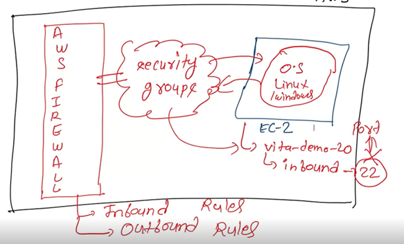

## How to create Bucket?
**Steps:**
  >+ Go to services>type S3(scalable storage in the cloud)
  > + create bucket>Give any name to bucket suppose I give demo>Remaining things keep as it is>click on create bucket

It give error,as it already exisits why is it so?\
we had not create bucket before,Then why it is saying that it already exists?\
when you create bucket ,bucket name is always region wise like global. In global dropdown it will say that s3 does not require the global selection.\
**So, this name should be unique across the aws.**

> + Now give the name as vita-demo-20 > click on create bucket.\
Now our bucket is ready

> + Now click on  that vita-demo-20\
In that we have different options : \
1] create folder\
2)Upload\
Now let upload some file 
 > + click on the upload \
How to make a folder? 
> + click on create folder> give the folder name as demo >save

>  
