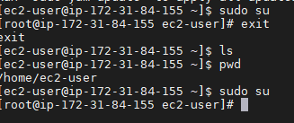
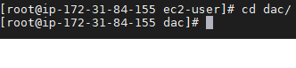
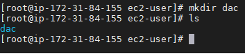
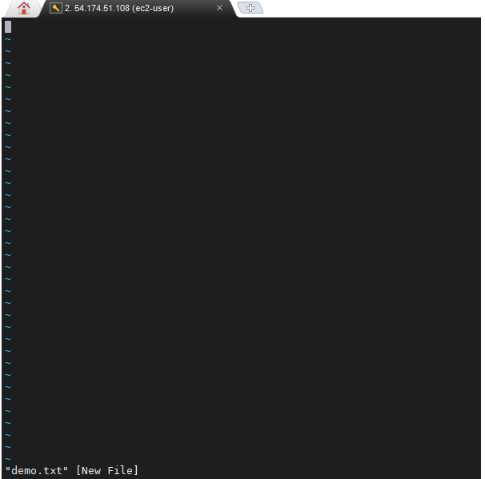

# Linux Commands:
> + Sudo su\
If u want to go to root user cmd is sudo means root
> + ls\
list directory
> + pwd \
print working directory \
>  
> + Cd \
> change directory \
>   
> + clear \
To clear screen
> + Mkdir \
If you want to make 1 folder
>  
> + Vi filename \
we can make the .txt file 
>   
> + i \
It shows insert
> + :w \
write in  the file
> + :q \
 quit exit from the current file
> + :wq \
write and quit is cmd to write as well as quit
> + :wq! \
Force to quit forcefully
> + Help cmdname \
gives all the info about commands
> + cp source destination \
Copies file from source to destination
> + mv source destination \
Moves file from source to destination

**ls,cd,pwd=navigation commands**

 +  i  -  insert mode
 +  w - to save permanantely
 +  :q - quit

