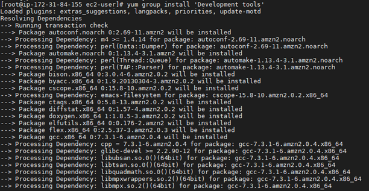
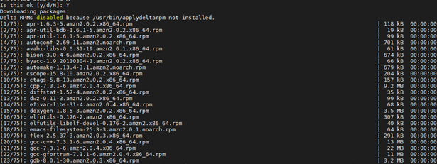
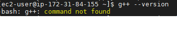
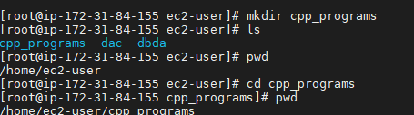
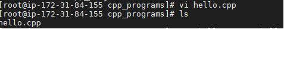
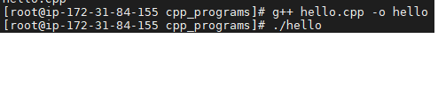

# COMPILE AND RUN CPP FILE USING LINUX [COMMAND LINE]:
### **Steps:**

To check whether you are having g++ tool in your linux system or not.
For that,use a command:

**g++ --version**
 > If it is not installed, then follow below instructions:
 >  + Enter following command in your linux terminal:\
**yum group install 'Development tools'**
>   

>    + Now, enter **Y** and hit enter\
>   

>    + To check whether g++ tool install successfully or not  enter following command\
**g++ --version**\
>  

## Make a directory:

> Create a directory to save our cpp code in particular directory.
> + To create directory name as cpp_programs enter following command in linux terminal\
**mkdir cpp_programs**
> + To check whether our directory created or not enter following command\
**ls**\
Which will list all files and directory of current working directory 
> + Now change current path to cpp_programs by using following command\
**cd cpp_programs**

> 

## How to compile cpp code in Linux Terminal?:

> + First create cpp file using vi tool by using following command\
**vi hello.cpp**
>  

> + Then enter **i** to enter in insert mode
> + Now write you cpp code
> + Once done press esc key and enter following command to save your code into .cpp file\
**:w**
> + Now to exit from current file press esc key and write following command\
**:q**
> + Check whether  .cpp file has been created successfully or not enter following command\
**ls**
> + Now compile your file using g++ tool, to compile enter following command\
**g++ hello.cpp -o hello** 
## How to Run cpp code in Linux Terminal?:
> + Now Execute your output file using following command\
**./hello**\
>  

