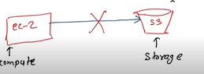
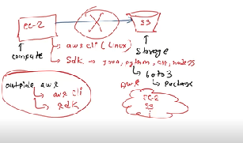

# COMMUNICATION BETWEEN SERVICES

> Suppose,we have 2 services 
> + ec2
> + s3 bucket
 
Generally ec2 is not able to communicate with s3.\
>   

To make it communicate we have to do some things:
> There are different ways
> + aws cli( it is simple like linux)\
> Aws has made APIs.API  means like we use the commands in a linux like that only we have aws cli.
> + SDK\
Sdk is available in the languages like Java,python,c#,node js\
Java sdk is known as java,
Python sdk is known as boto3 package.\
>   

> By using this aws **services can communicate** with the each other.\

> **OUTSIDE AWS**\
Means anything like from laptop we can communicate with aws services using aws cli and sdk\

## How aws cli work?
> write: \
> **aws < servicename >  -[command options]**\
Example:
**aws s3 ls**\
*It will give the list of all the buckets.*\
It will give error 
as We have seen that services cant communicate unless and until we don’t set a path .

### Then how to do this?
> In aws we have service: **IAM[IDENTITY ACESS MANAGEMENT] roles** (Identity)
 > + IAM roles gives identity which we can attach it with any service.
 > + Rules which authorizes are get attached to the IAM.\
In aws these rules are known as the **policies**
> + Policies means it defines rules which get attached with IAM.
> + If I have ec2 and s3 there is no comm between both
So we must have to make IAM role.
> + After making IAM , role policies are get attach to the IAM role like in **s3 dlt permission** or **s3 ls permission**
   
>**Like this communication link will get established between ec2 nd the s3**
 
