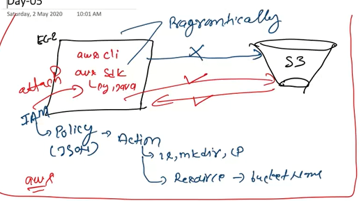
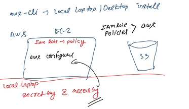

#### In part 1 ,We have seen that  2 services can't communicate with each other So we had attached the IAM rules to it
> + In poicy we give actions(ls)
> + Resource (Bucket name ,folder)

Then by doing this servicing communication is get established
> There are multiple ways:
> + Aws cli
> + sdk

>   

**Outside aws:**

For that we have to install the aws cli on local laptop.
> To check aws version\
Write a command:
> + Aws –version
> + If it is not giving error means sdk incli is get installed properly\
>   

**Aws s3 ls**\
It will give the error as unable to locate\
Write aws configure\
*steps:*

> + Go to my classroom>go to classroom> account details>show>
Go to cmd prompt>enter the access ID>copy acess ID>paste it into the notepad.
> + Access key copy it
Go to cmd>paste]enter
> + Acess key>copy and paste>region name> us-east-1
> + Default op format>json

>  By using:   **ls –a**\
> You will get the hidden files

**aws s3 ls**
> + It will give the list of all the buckets

It will give error 
We have seen that services cant communicate unless and until we don’t set a path 

## Then how to do this?
> + In aws we have service:**IAM roles(Identity)**
> + IAM roles gives identity we can attach it with any service
> + In aws these rules are known as the **policies**
> + Policies means it defines rules which get attached with IAM
> + If I have ec2 and s3 there is no comm between both
So we must have to make IAM role.
> + After making IAM role policies are get attach to the IAM rol like in **s3 dlt permission or s3 ls permission**

Like this communication link will get established between ec2 nd the s3

