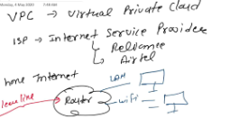

# VPC->Virtual Private Cloud
> + Internet is not owned by us we are not the owner of internet
There is common platform through whch we are connected.

> + If I have company and I want to develop some rules then we cant make it on common.Goverment has authority like to suspend the internet for some days.

> + *Example*:
> + When we apply the internet at our home ,then at that time we apply some things like router and cable then ISP(Internet Service Providers)  through router they plugin wire . 

> + Then we can connect it through the LAN to computer 

> + But, they hide something like they have to ctrl some things like speed.

> + **VPC-virtual private cloud which is on organization level
They ctrl the configuration like accessibility pf port**

> + Amazon Virtual Private Cloud (Amazon VPC) lets you provision a logically isolated section of the AWS Cloud where you can launch AWS resources in a virtual network that you define. 

> + You have complete control over your virtual networking environment, including **selection of your own IP address range, creation of subnets, and configuration of route tables and network gateways**. You can use both IPv4 and IPv6 in your VPC for secure and easy access to resources and applications.

> 