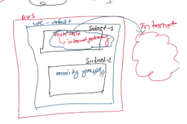

> + **Ipv4 CIDR**\
> These are the range of ip addresses public and private IP

> + **Route table(Router)**\
When we apply router route table can help to communicate with the internet.
It helps to connect with the world .It has internet gateways

> + **Intrnet gateways**\
> It normally provides the internet connection so that we can communicate with the internet.

> + If I have aws account in which we have 1 vpc-default
> + In that we have subnets like \
> 1] public \
> 2] private
> + Suppose we have 2 subnets here
> + In subnets we have the route table 
> + Internet gateway is attached with the internet gateways
> + It is only get used to communicate with the Internet.
> + But security groups come under the subnets
> + In Subnet Groups we have different inbound and outbound trafiic ctl things

> 
