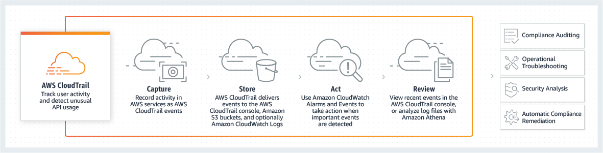

# CLOUD WATCH VS CLOUD TRAIL
> **Cloud Watch**
> +  Monitors resources and applications like CPU or RAM utilization.
> + CloudWatch provides you with data and actionable insights to monitor your applications, respond to system-wide performance changes, optimize resource utilization
> + CloudWatch collects monitoring and operational data in the form of logs, metrics, and events, providing you with a unified view of AWS resources, applications, and services that run on AWS and on-premises servers.

# How it works?
> 

> **Cloud Trail**
> + User Activity Tracker
> + In aws UI whichever actions you performed are get stored in cloud trail. Action like If u sop the instance.
> + With CloudTrail, you can log, continuously monitor, and retain account activity related to actions across your AWS infrastructure.
> + CloudTrail provides event history of your AWS account activity, including actions taken through the AWS Management Console, AWS SDKs, command line tools, and other AWS services.

# How it works?
> 

> **Feedback cmd**
> + It  is a command where u have to give the input
Like yes or no.
